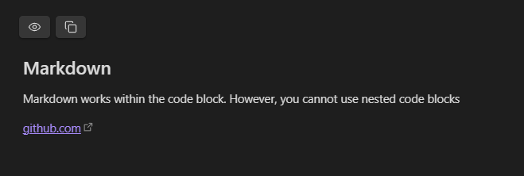
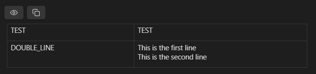
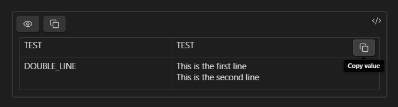

# 🫣 Obsidian Spoilers

> Obsidian plugin for creating hidable blocks of content

Quickly and easily hide content in your Obsidian documents.

## Spoiler blocks

Initially spoiler blocks will appear like the following:


The first button will show/hide the content and the second button will copy the text to your clipboard

Below are the different kinds of spoiler blocks that are available

## 📄 Plain text blocks

You can create plain-text hidden content using the `spoiler` code block language:

````
```spoiler
This text is hidden with a spoiler
```
````

## 🔮 Markdown blocks

You can place markdown content in spoiler blocks by using the `spoiler-markdown` code block language:


````
```spoiler-markdown

## Markdown 

Markdown works within the code block.

[github.com](https://github.com)
```
````

When revealed the markdown will be visible



> [!NOTE]
> Code blocks are not supported within markdown blocks 


## 🔑 Environment variables

You can store environment variables using the `spoiler-env` code block language:

````
```spoiler-env
TEST=TEST
DOUBLE_LINE=`This is the first line
This is the second line`
```
````

These are parsed using [dotenv](https://www.npmjs.com/package/dotenv) and are displayed in a table:



Which allows you to copy individual keys and values

